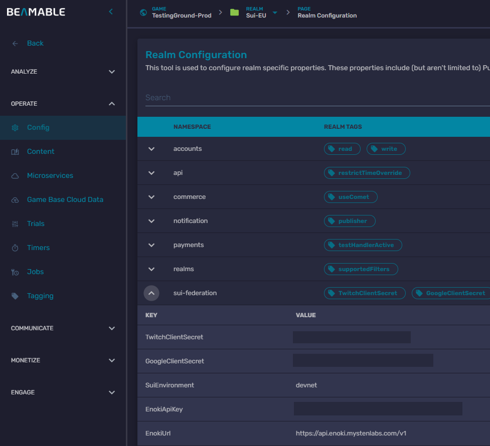

# 🧩 Cross-Platform Sui Integration – Unity • Unreal • Microservices • Wallet Integration

Welcome to the unified repository for our cross-platform SUI integration. This monorepo consolidates all major components required to integrate Sui blockchain features into both Unity and Unreal Engine projects, along with necessary microservices and wallet support.

---

## 📦 Repository Overview

---

## 🎮 Project Components

### 🧠 Unity Game Sample
- Built with Unity 6
- Beamable SDK integration for online services (auth, stats, leaderboards, etc.)
- Sui wallet support for WebGL builds via custom JavaScript bridge
- Optimized for Web, Android, and iOS platforms
[Unity Readme](https://github.com/beamable/Sui-MonoRepo/blob/main/Unity/README.md)

### 🎬 Unreal Engine Game
- Built with Unreal Engine 5+
- Modular plugin-based architecture
- Supports Sui wallet integration via Blueprints and some C++ code
[Unreal Readme](https://github.com/beamable/Sui-MonoRepo/blob/main/UnrealSample/README.md)

### ☁️ Microservices
- Built using .NET 6+ and Beamable Microservice SDK
- Services include:
    - Federated Authentication
    - Federated Inventory
- Deployed via Beamable CLI or Docker
- This has already been linked to both the Unity and Unreal projects

### 🔐 Wallet Integration
- Supports Sui wallet bridge (e.g. via `@mysten/wallet-standard`)
- Compatible with Unity WebGL builds using a `.jslib` plugin
- Compatible with Unreal Engine via a C++ module and external browser bridge
- TypeScript → Webpack → UMD bundle

### 💻 Enoki setup
SUI Enoki feature allows users to create a non-custodial wallet using familiar Web 2.0 logins, such as their Google account, through a technology called zkLogin. This removes the need for users to manage complex seed phrases and additional passwords. Developers can use Enoki to pay for their users transaction fees (or "gas fees"). This creates a seamless experience where users can interact with an application without needing to own SUI cryptocurrency beforehand.
Steps to enable SUI Enoki feature:

#### OAuth Client Application
You’ll need to create an OAuth client whenever application needs to authenticate users or access APIs on their behalf. When you register your app with an authorization server, you receive:
 - Client ID – A public identifier for your application
 - Client Secret – A private key used to authenticate your app
 - Redirect URI(s) – URLs to which the authorization server redirects users after they grant or deny consent

 This project implements Google and Twitch OAuth provider support. Create your OAuth client on [Google](https://console.cloud.google.com/auth/clients) or [Twitch](https://dev.twitch.tv/console/apps) dashboard.  
 Populate redirect URI with the following microservice endpoint:
 - `https://api.beamable.com/basic/{CustomerId}.{ProjectId}.micro_SuiFederation/OAuthCallback`
 - find your CustomerId and ProjectId on your [Beamable Project Portal](https://portal.beamable.com/)

#### Enoki Portal
- create an account on [Enoki portal](https://portal.enoki.mystenlabs.com/)
- create your preferred Oauth provider client app
- create a new Enoki App and preferred Auth provider client by providing ClientId created in the OAuth Client Application
- in the Overview section enable zkLogin and Sponsored transaction features
- enable support for target SUI networks

#### Beamable Portal
To enable microservice access to the defined Enoki and OAuth application you need to provide following data in the Realm configuration section of your [Beamable project](https://portal.beamable.com/).  
(Realm configuration is a key-value type store that supports runtime value updates to the microservice.)

 - EnokiUrl – path to the Enoki API (`https://api.enoki.mystenlabs.com/v1`)
 - GoogleClientSecret or TwitchClientSecret - depending on the desired provider, client secret string created in the OAuth Client Application
 - EnokiApiKey – Enoki API access key created in the Enoki Portal

#### Extending Enoki supported OAuth providers
 Additional OAuth provider support can be added by implementing the [required interface](https://github.com/beamable/Sui-MonoRepo/blob/main/Unity/services/SuiFederation/Features/OAuthProvider/IOauthProvider.cs) in the microservice. The same folder includes examples of Google and Twitch implementation examples. 

---